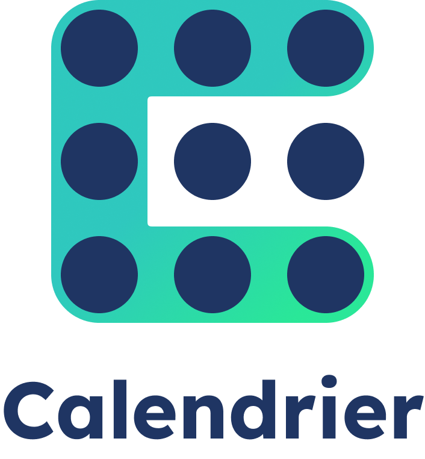

# Mon super calendrier



**Contexte** : Vous venez d'être embauché au sein d'une petite société de service bordelaise. Malgré un bon fonctionnement général et suite aux différentes crises sanitaires, votre entreprise peine à trouver une organisation de planning satisfaisante. Elle décide donc de vous mettre sur le coup ainsi que son meilleur développeur front-end afin de construire un portail interne de gestion de calendrier. Cette application aura pour but de gérer les jours de télétravail et de congés de toute l'entreprise. 

**Consignes de depart** : Ce document fait office de cahier des charges et sera une référence tout au long du projet. Vous trouverez ci-dessous une liste exhaustive des models et des routes a implémenter. L'organisation du code source est libre, **CEPENDANT** l'organisation de code recommandée par NestJS est FORTEMENT recommandée. Votre notation sera basée sur le nombre de tests qui passent avec succès et sera ponderée par votre style de code (propreté, intelligence de code, conventions de nommage, ...). Tout au long de ce document, vous trouverez des notes apportées par votre collègue développeur front-end qui vous donnera le format de retour ou des types d'erreurs à retourner. 
**Tout plagiat sera fortement sanctionné par une note de 0 à la fin du module.**

Vous trouverez toutes les informations nécessaires a l'installation du projet et au lancement des tests dans le fichier `README.md`.

## Models

Vous trouverez ci-dessous une liste exhaustive des differents models à implémenter pour réaliser ce projet. Chaque model sera décrit par ses propriétés, et, chacune d'elles seront définies par leurs types et par un `!` ou un `?` selon si elles sont respectivement requises ou optionnelles pour traiter l'entité. De plus dans le cas où la propriété est optionnelle, lorsqu'une valeur par defaut sera à attribuer cette valeur sera expressement précisée.
Note : Ces models seront donnés sous forme de classe avec le strict minimum d'informations. Il ne faudra pas simplement copier-coller ces blocs de code pour que cela fonctionne.

### user.entity.ts

```ts
class User {
  public id!: uuidv4;
  public username!: string; // cette propriété doit porter une contrainte d'unicité
  public email!: string; // cette propriété doit porter une contrainte d'unicité
  public password!: string;
  public role!: 'Employee' | 'Admin' | 'ProjectManager' // valeur par defaut : 'Employee'
}
```

### project.entity.ts
```ts
class Project {
  public id!: uuidv4;
  public name!: string;
  public referringEmployeeId!: uuidv4;
}
```

### project-user.entity.ts
```ts
class ProjectUser {
  public id!: uuidv4;
  public startDate!: Date; 
  public endDate!: Date; 
  public projectId!: uuidv4;
  public userId!: uuidv4;
}
```

### event.entity.ts
```ts
class Event {
  public id!: uuidv4;
  public date!: Date;
  public eventStatus?: 'Pending' | 'Accepted' | 'Declined' // valeur par défaut : 'Pending';
  public eventType!: 'RemoteWork' | 'PaidLeave';
  public eventDescription?: string;
  public userId!: uuidv4;
}
```

## Routes 

Vous trouverez ci-dessous une liste exhaustive des différentes routes à intégrer organisées par model cible pour réaliser ce projet. A chaque route sera associé une description métier de la route fournie par votre employeur ainsi que, si nécessaire, une note du développeur front-end qui travaille avec vous sur ce projet.
Attention à bien respecter scrupuleusement le chemin donne par vos routes, sans quoi, vos tests ne pourront s'effectuer convenablement. Si nécessaire, à la suite du speech client et des potentielles notes du développeur front-end, vous trouverez les paramètres de la routes si celle ci en a besoin.
*Sauf indication contraire toutes les routes devront être protegées. (Devra renvoyer une 401 (Unauthorized) si l'utilisateur n'est pas connecté).*

### users.controller.ts

#### POST users/auth/sign-up (route publique)

Speech client : Je veux pouvoir m'inscrire sur le portail afin de pouvoir gérer mon planning ainsi que celui de mon équipe.

*Notes du développeur front-end: Pour cette route, je t'envoie le username, le password et l'email. Je n'ai pas eu le temps de mettre en place de la validation sur mon formulaire, peux-tu t'en occuper ? Il faudrait un mot de passe d'au moins 8 caractères, un email bien formatté et un username d'au moins 3 caractères. Attention à bien gérer l'attribution des roles, je ne te l'envoie pas forcément. Penses à ne jamais renvoyer le mot de passe des utilisateurs, sur aucune route, sinon le patron ne va vraiment pas être content...*

```
Parametres (body) :

username!: string;
password!: string;
email!: string;
role?: 'Employee' | 'Admin' | 'ProjectManager';
```

#### POST users/auth/login (route publique)

Speech client : Je veux pouvoir me connecter sur le portail afin de pouvoir accéder a toutes les fonctionalités qui necessitent une authentification.

*Notes du développeur front-end: Mon formulaire est pret ! Je vais t'envoyer l'email et le mot de passe saisi. Ah et penses bien à me renvoyer le JWT dans un objet contenant la clé `access_token` pour que je puisse le stocker de mon côté et te le renvoyer dans chaque requête qui auront besoin d'une authentification pour fonctionner*

```
Parametres (body) :

email!: string;
password!: string;
```

#### GET users/:id

Speech client : Je veux pouvoir voir les informations personnelles d'un utilisateur de la plateforme en particulier.

```
Parametres (query) :

id!: uuidv4;
```

#### GET users/

Speech client : Je veux pouvoir voir la liste de tous les utilisateurs actuellement inscrits sur la plateforme

#### GET users/me

Speech client : Je dois pouvoir afficher sur la plateforme les informations personnelles de l'utilisateur actuellement connecté

*Notes du développeur front-end : Tu peux utiliser le token d'authentification que je t'envoie dans la requête pour identifier la personne actuellement connectée.* 

#### GET /users/:id/meal-vouchers/:month

Speech client : Afin d'éviter des erreurs comptables dans le calculs des titres restaurants, je veux pouvoir voir le montant de titres restaurants d'un utilisateur en particulier. Nous travaillons du Lundi au Vendredi sans interruption, et ce, même les jours féries. L'entreprise accorde 8 euros de titres restaurants par jour travaillé par employé. Bien evidemment, un employé n'a pas le droit aux titres restaurants les jours de télétravail ou de congés payes.

```
Parametres (query) :

id!: uuidv4;
month!: number; //nombres de 0 (Janvier) a 11 (Decembre)
```

### projects.controller.ts

#### GET /projects

Speech client : Je veux pouvoir voir la liste de tous les projets de l'entreprise. Je veux également que les projets soient soumis a un système de permission. Les utilisateurs *Administrateurs* ou *Chef de projet* peuvent voir tous les projets tandis que les *Employés* ne peuvent voir que les projets dans lesquels ces derniers sont impliqués.


#### GET /projects/:id

Speech client : Je veux pouvoir voir la liste de tous les projets de l'entreprise. Evidemment je veux que cette fonctionnalité soit soumise a la meme règle de permission que celle permettant de voir tous les projets.

*Notes du développeur front-end : Dans le cas où un utilisateur n'a pas le droit de consulter le projet demandé, il faudrait que tu me renvoies une **ForbiddenError***.

```
Parametres (query) :

id!: uuidv4;
```

#### POST /projects

Speech client : Je veux pouvoir créer un projet. Chaque projet possède un nom, une description et un référent. Evidemment un *Employé* ne pourra assumer ce rôle. Seul un *Administrateur* doit pouvoir créer un nouveau projet.

*Notes du développeur front-end : Si une personne essaie de créer un projet sans être administrateur, il faut que tu me renvoies une **UnauthorizedException**. Fais en de même si la personne référente donnée n'est pas au minimum un chef de projet. Je n'ai pas fais de validation sur mon formulaire, penses a vérifier que le nom du projet contient au moins 3 caractères. Ah et pour que je puisse afficher une modale de succès, il faudrait que tu m'inclues la relation **referringEmployee** dans le retour de la route.*

```
Parametres (body) :

name!: string;
referringEmployeeId!: uuidv4;
```

### project-users.controller.ts

#### GET /project-users

Speech client : Je veux pouvoir voir toutes les assignations de mes employés aux différents projets. Tout comme avec les projets, cette fonctionnalité doit être limitée par le même système de permissions que sur les projets. Les employés ne doivent pouvoir voir que leurs propres affectations. 

#### GET /project-users/:id

Speech client : Je veux pouvoir voir une assignation à un projet en particulier. Tout comme la liste globale, un employé ne doit pas avoir accès aux assignations des autres personnes.

*Notes du développeur front-end : Dans le cas où tu n'as pas accès a la ressource demandée, penses bien a me renvoyer une UnauthorizedException.*

```
Parametres (query) :

id!: uuidv4;
```

#### POST /project-users

Speech client : Un administrateur ou un chef de projet doit pouvoir assigner un employé à un projet pour une durée determinée. Attention, il ne doit pas être possible d'être affecté à deux projets en même temps.

*Notes du développeur front-end : Dans le cas où l'employé est déjà affecté à un projet pour la période demandé tu dois me renvoyer une ConflictException. Tout comme dans les autres routes, si un utilisateur n'a pas les droits pour effectuer cette action, il faut que tu me renvoies une UnauthorizedException. Ah et pour que je puisse afficher une modale de succès, il faudrait que tu m'inclues les relations **user** et **project** dans le retour de la route.*

```
Parametres (body) :

startDate!: Date;
endDate!: Date;
userId!: uuidv4;
projectId!: uuidv4;
```

### events.controller.ts

#### GET /events

Speech client : Je veux pouvoir voir tous les évènements planifiés de tous les utilisateurs.

#### GET /events/:id

Speech client : Je veux pouvoir voir les informations d'un évènement en particulier.

*Notes du développeur front-end : Penses bien a me renvoyer l'erreur appropriée dans le cas ou l'évènement demandé n'est pas trouvé.*

```
Parametres (query) :

id!: uuidv4;
```

#### POST /events

Speech client : Je veux que mes utilisateurs puissent poser un évènement de type *Télétravail* ou *Congé payé*. Voici la règlementation actuellement en place au sein de l'entreprise : 
- Il est impossible de se mettre en télétravail plus de deux jours par semaine
- Il est impossible d'avoir deux évènements quel que soit le statut de ce dernier sur la meme journée
- Les télétravails ne sont pas soumis à validation d'un supérieur
- Si un *Employé* essaie de créer un évènement de congé, ce dernier est en statut *En attente* et sera soumis à validation d'un supérieur

*Notes du développeur front-end : il est impossible de créer un évènement pour quelqu'un d'autre, tu peux déduire le userId via la requête.*

```
Parametres (body) :

date!: Date;
eventDescription?: string;
eventType!: 'RemoteWork' | 'PaidLeave';
```

#### POST /events/:id/validate
#### POST /events/:id/decline

Speech client : La validation de congés payes se fait sous certaines conditions : 
- Il est impossible d'altérer le statut d'un projet déjà validé ou refusé
- Les administrateurs peuvent valider n'importe quelle demande
- Il n'est possible de traiter un évènement que si l'utilisateur est rattaché à un projet le jour de l'évènement
- Les chefs de projet peuvent valider ou refuser un évènement que si l'utilisateur est rattaché à un projet où le chef est référent pour la date de l'évènement.

```
Parametres (query) :

id!: uuidv4;
```

### BONUS

- Afin d'être conforme aux consignes delivrés par la CNIL, vous devez tracer toutes les requêtes effectuées sur votre API. Pour ce faire, vous *intercepterez* chaque requête effectuée et écrirez dans un fichier logs.txt une ligne par requête. Une ligne devra contenir : l'ip de la machine ayant fait la requête, la route appelée, les paramètres si ils existent ainsi que la date et l'heure de la requête.

- Afin de faciliter la communication des jours planifiés aux RH, il doit être possible d'exporter un csv contenant la liste de tout les congés acceptés du mois en cours. Une ligne correspondra a un évènement. Sur cette ligne devra également apparaitre le nom et prénom de l'utilisateur ayant pris son congé et le projet auquel ce dernier était rattaché le jour de son congé.

- Afin d'éviter au maximum toute intervention humaine, le csv ci-dessus devra être géneré automatiquement le 25 de chaque mois et sera stocké dans un fichier à la racine du projet.

## Notes techniques

- Le projet se faisant avec une base de type postgres, vous devez utiliser TypeOrm afin de traiter vos données en base.
- Le paquet dayjs est fourni, n'hésitez pas à l'utiliser pour la gestion des dates.
- L'architecture du projet etant fournie, vous n'avez pas a créer de nouveaux dossiers.
- Vous pourrez tester votre API via Postman. Cependant, la mise en place d'un swagger vous facilitera les choses.
